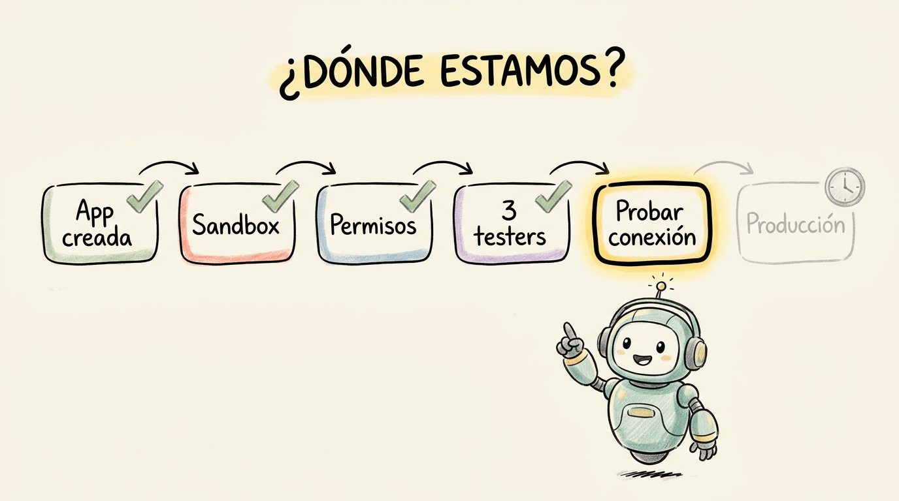

# visual-report-builder

A Claude Code skill that produces single-file HTML reports in a locked
hand-drawn / notebook-sketch design system. Drop in a topic + audience,
get back a beautiful, skimmable, offline-shareable artifact with 2-3
hand-drawn illustrations.

Built by [Guorks Labs](https://github.com/guorks).

**v0.2 (this branch):** authoring produces a typed `report.json` IR;
the deterministic Node renderer (`bin/render.ts`) turns it into HTML.
An eval harness (`bin/eval.ts`) grades the IR with structural, tone,
and optional LLM-as-judge checks. Image generation is backed by a
content-addressable cache so repeat prompts are free.



## What it does

Give it:
- A **topic** (e.g., "status of our TikTok integration")
- An **audience** (engineers / non-tech / operators / investors / mixed)
- A **language** (Spanish / English)
- (optionally) a **report type** (status / postmortem / kickoff /
  launch / comparison / decision-memo / user-story)

Get back: a single self-contained `.html` file with 2-3 hand-drawn
illustrations embedded, opened in your browser.

## Install

### Option 1 — drop-in skill folder (simplest)

```bash
git clone https://github.com/guorks/visual-report-builder
cp -r visual-report-builder ~/.claude/skills/
```

That's it. Restart Claude Code if it was running. The skill will appear
in the available-skills list.

### Option 2 — Claude Code plugin

```bash
# inside Claude Code
/plugin add github.com/guorks/visual-report-builder
```

### Option 3 — read-only browse

You don't need to install it to look at the examples. The
`examples/tiktok-status-spanish/` folder has a complete working report
you can open in any browser.

## Use

In any Claude Code session:

```
make me a status report for the team about our payments integration
```

Or more explicitly:

```
build a launch announcement for the new dashboard, audience non-tech, en español
```

The skill will:
1. Ask clarifying questions (if anything's missing)
2. Generate 2-3 illustrations via Higgsfield (~6 credits)
3. Render the HTML
4. Open it in your browser

## Report types

| Type | Use when |
|---|---|
| `status` | Where are we / what's done / what's next |
| `postmortem` | Something broke; here's what happened |
| `kickoff` | We're starting X; here's the plan |
| `launch` | We just shipped X; tell the world |
| `comparison` | A vs B; help me pick |
| `decision-memo` | This is the decision; documenting it |
| `user-story` | When user does X, app should Y (Given/When/Then) |

## Audience modifiers

The same content gets re-toned per audience:

| Audience | Tone |
|---|---|
| `engineers` | Terse + precise. Code, file paths, error codes welcomed. |
| `non-tech` | Warm + analogy-heavy. Jargon-free. |
| `operators` | Action-oriented. Step-by-step. What to do if X breaks. |
| `investors` | Metric-heavy. KPIs, milestones, market positioning. |
| `mixed` | Middle ground. Default when audience isn't specified. |

## Requirements

- Claude Code with the [Higgsfield MCP](https://higgsfield.ai) connected
  (the skill uses `nano_banana_pro` for illustrations).
- Node ≥ 20 with `npm` for the renderer + eval harness.
- ~6 Higgsfield credits for a first invocation; repeats with the same
  prompts cost 0 credits via the content-addressable cache.
- A working `open` command (or you'll need to open the file path
  manually — the skill prints it).
- **Optional:** `ANTHROPIC_API_KEY` to run the LLM-as-judge eval mode
  (`npx tsx bin/eval.ts --judge`). Structural + tone checks run fine
  without it.

## Developer setup

```bash
npm install
npm test                    # XSS / escape regression
npx tsx bin/render.ts examples/tiktok-status-spanish/report.json
npx tsx bin/eval.ts         # structural + tone over the goldset
```

## Examples

- [`tiktok-status-spanish/`](examples/tiktok-status-spanish/) — full
  status report in Spanish for an engineering team. Open
  `tiktok-integracion-estado.html` in a browser.

## What's locked vs flexible

**Locked (no customization in v2):**
- The hand-drawn cream/sketch design system
- Outfit / Inter / Caveat / JetBrains Mono fonts
- Higgsfield as the image provider
- Single-file HTML output
- The IR schema (`src/schema.ts`) — node kinds are fixed; extend by
  adding a new typed node, not by smuggling raw HTML

**Flexible:**
- Report type + audience + language (the 3 axes you pick at invocation)
- Number of sections (each report type has a recipe but you can omit
  sections if the content isn't there)
- Section content + tone (audience modifier handles)
- Image cache location (`VRB_CACHE_DIR` env var)

## Roadmap

- **v0.1:** 7 report types × 5 audiences × 2 languages = 70 covered
  combinations.
- **v0.2 (this branch):** Typed IR + deterministic renderer + zod
  schema + eval harness (structural / tone / LLM judge) + image-prompt
  cache + cost ledger + trace log.
- **v0.3 (next):** Dark mode / alt themes. More languages. PDF export.
  Pixel-diff snapshot tests once themes ship.
- **v1.0 (eventually):** Customizable design tokens, plugin-installable
  components.

## License

MIT. See [`LICENSE`](LICENSE).
